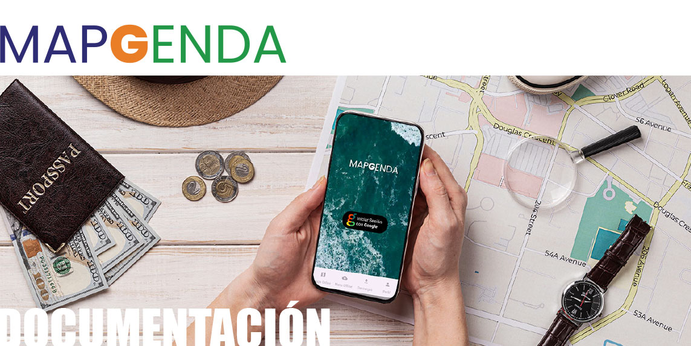
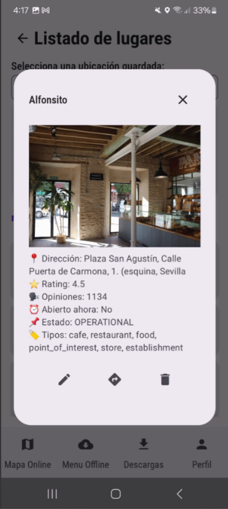
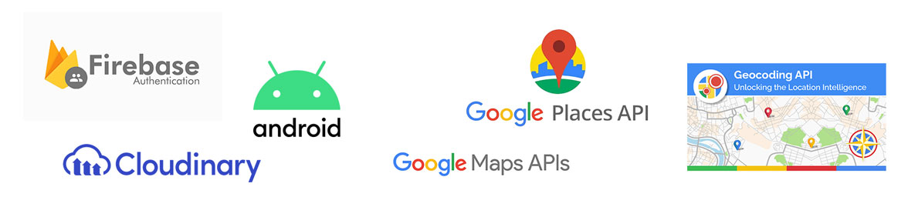
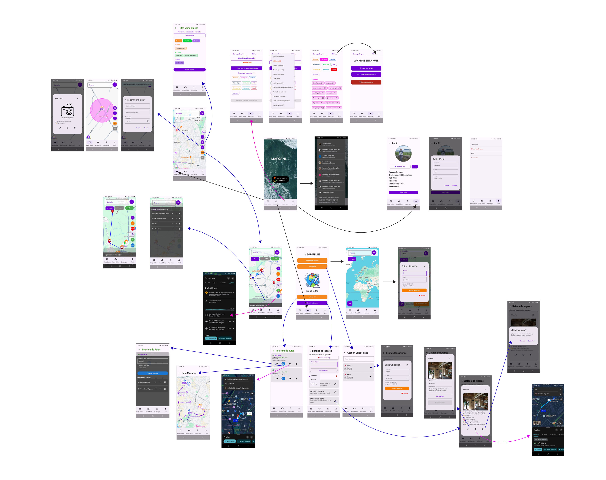

# 🗺️ Mapgenda

Aplicación móvil de turismo personalizado que permite a los usuarios encontrar lugares de interés cercanos según sus preferencias, guardar favoritos y acceder a ellos sin conexión. Gracias a la integración con Google Maps y otros servicios de geolocalización, ofrece una experiencia de exploración intuitiva, visual y optimizada para usuarios en movimiento.

---



---



--

## ✨ Características Principales

- Descubrimiento de lugares cercanos
- Integración con Google Maps, Places y Directions API
- Rutas para caminar o andar en bicicleta
- Guardado de lugares con acceso offline
- Autenticación con Google Sign-In
- Gestión de imágenes en la nube con Cloudinary
- Conexión con ApiRest Mapgenda_Backend

---

## 📚 Tecnologías y Herramientas Empleadas

### 🧩 Base del Proyecto

- **Kotlin**: Lenguaje principal
- **Jetpack Compose**: Framework declarativo de UI
- **Material 3 + Material Icons**: Diseño moderno y accesible
- **Navigation Compose**: Navegación entre pantallas
- **Room**: Base de datos local persistente
- **StateFlow + ViewModel**: Arquitectura MVVM

### 🔌 Comunicación y Backend

- **Retrofit**: Cliente HTTP para conectarse con APIs
- **Gson**: Serialización y deserialización JSON
- **Kotlin Coroutines**: Flujo asincrónico sin bloquear la UI

### 📍 Servicios de Google

- **Places API**: Datos de puntos de interés
- **Geocoding API**: Coordenadas ↔ Direcciones
- **Location Services**: Ubicación precisa en tiempo real
- **Firebase Auth + Google Sign-In**: Inicio de sesión seguro

### 🎥 Multimedia y Visuales

- **Media3 (ExoPlayer)**: Reproducción de video
- **Cloudinary**: Gestión de imágenes y videos (con CDN)
- **Coil**: Carga eficiente de imágenes en Compose

---

## 🖼️ Stack Tecnológico



---

## 🧭 Flujo de Navegación



---

## 📄 Documentación Técnica

Puedes consultar la documentación detallada del proyecto aquí:

👉 [Ver PDF - Documentación Técnica 2025](docs/MapGenda_Documentacion_2025.pdf)

---

## 🛠️ Instalación y Ejecución

> **Requisitos previos**:
> - Android Studio Meerkat | _2024.3.1 o superior_
> - Dispositivo Android físico o emulador configurado con servicios de Google Play

1. **Clona el repositorio**:
   ```bash
   git clone https://github.com/tu-usuario/Android_Mapgenda.git
   cd Android_Mapgenda
